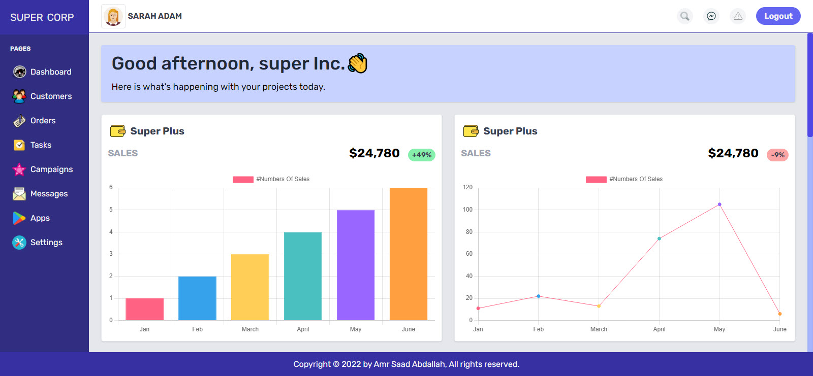
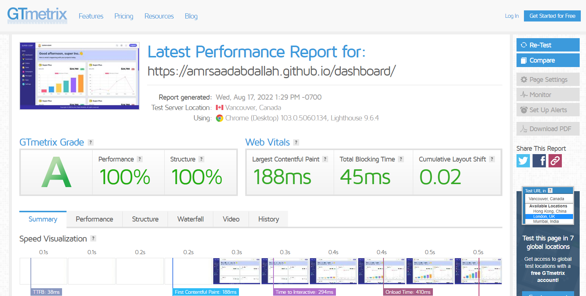

<h1 align="center">  DASHBOARD  &mdash; TAILWINDCSS  TEMPLATE </h1>

### 👁️ Project Preview:

- [ Live Preview 👉 https://amrsaadabdallah.github.io/dashboard](https://amrsaadabdallah.github.io/dashboard)

- [ Github Repo 👉 https://github.com/amrsaadabdallah/my-dashboard](https://github.com/amrsaadabdallah/my-dashboard)
    - 🚩 It's a private repo <a target="_blank" href="mailto:amrsaadabdallah@gmail.com">contact me </a>to see.

---

### 📝 Project Description & features:

- It's a Dashboard Template used to practice TailwindCSS.
- It consists of 1 page (Home) .

---

### 🛠️ Project Tools:

1. Used Google Fonts.

1. TailwindCSS Framework for styling.

1. [ChartJS](https://www.chartjs.org) is a Library for create charts.

1. ParcelJS a Bundler Tool.

1. [Squoosh](https://squoosh.app/) is an online tool for image compression web app that reduces image sizes through numerous formats.

1. [GTmetrix](https://gtmetrix.com/) is an online tool for customers to easily test the performance of their webpages.

---

### :sparkles: Project Skills applied:

1. Link Web Fonts (Rubik) from google fonts.

1. Practice Tailwindcss Framework.

1. Applied mibile first technique to create a responsive web app.

1. Handle charts using chartsJS library.

1. Update Current year with JavaScript.

1. Bundle project by using Parceljs.

1. Compression images using Squoosh tool.

1. Test the performance of the webpage after deploy by using [GTmetrix](https://gtmetrix.com/).

---

### 🧪 Project performance test:

Test the performance of the webpage after deploy by using [GTmetrix](https://gtmetrix.com/).

---

### 👋 Get In Touch:

- [🌐 Website 👉 https://amrsaadabdallah.github.io](https://amrsaadabdallah.github.io)
- [👔 LinkedIn 👉 https://www.linkedin.com/in/amrsaadabdallah](https://www.linkedin.com/in/amrsaadabdallah)
- [🌟 Github 👉 https://github.com/amrsaadabdallah](https://github.com/amrsaadabdallah)
- [📧 Gmail 👉 amrsaadabdallah@gmail.com](mailto:amrsaadabdallah@gmail.com)
- [🐤 Twitter 👉 https://twitter.com/amrsaadabdallah](https://twitter.com/amrsaadabdallah)
- [:phone: Whatsapp 👉 (+20) 109-775-6067](https://api.whatsapp.com/send/?phone=%2B2001097756067&text&type=phone_number&app_absent=0)

---

<a target="_blank" href="https://amrsaadabdallah.github.io">

 2022 &copy; Amr Saad Abdallah 

</a>

